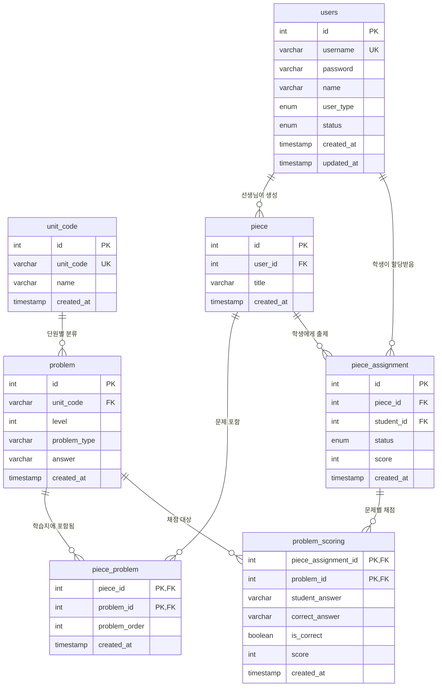

# Piece - 학습지 시스템

> Kotlin + Spring Boot 기반의 교육용 학습지 관리 플랫폼

## 개요

선생님이 문제 은행에서 문제를 선별하여 학습지를 만들고, 학생들에게 출제할 수 있는 REST API 시스템

## 기술 스택

### Backend
- **Language**: Kotlin
- **Framework**: Spring Boot 3.5
- **Database**: H2
- **ORM**: JPA/Hibernate
- **Security**: Spring Security + JWT
- **Build Tool**: Gradle

### Architecture
- **Clean Architecture**: Domain-driven Design 적용
- **Layer 구조**: Presentation → Application → Domain <- Infrastructure
- **CQRS Pattern**: 명령과 조회 분리


## 실행 방법

```bash
# 프로젝트 빌드
./gradlew build

# 애플리케이션 실행
./gradlew bootRun

# 테스트 실행
./gradlew test
```

## 프로젝트 구조

```
src/main
├── domain/                    # 도메인 레이어
│   ├── model/                 # 도메인 모델
│   ├── service/               # 도메인 서비스
│   ├── command/               # 커맨드 객체
│   ├── store/                 # 쓰기 전용 repository 인터페이스
│   └── reader/                # 읽기 전용 repository 인터페이스
├── application/               # 애플리케이션 레이어
│   ├── service/              # 애플리케이션 서비스
│   └── dto/                  # 커맨드/쿼리 객체
├── infrastructure/           # 인프라 레이어
│   ├── persistence/          # 데이터 영속성
│   │   ├── entity/
│   │   └── repository/
│   └── security/              # 보안
└── presentation/             # 프레젠테이션 레이어 > REST API 컨트롤러
```

## 데이터베이스 설계

### 핵심 테이블
- **users**: 사용자 정보 (Teacher, Student)
- **unit_code**: 단원 정보
- **problem**: 문제 은행
- **piece**: 학습지 메타데이터
- **piece_problem**: 학습지-문제 연관 테이블
- **piece_assignment**: 학습지 출제 관리
- **problem_scoring**: 문제별 채점 결과

### ERD diagram


## API 문서

API 사용법은 [API.md](./api.md) 를 참고해주세요.

## 위험요소 및 해결방안

### 동시성 문제

**위험요소**: 사용자의 더블클릭으로 인한 학습지 중복 생성 등의 동시성 이슈가 발생할 수 있습니다.

**해결방안**: Redis Distributed Lock을 활용하여 동시성 문제를 해결할 수 있습니다. 
학습지 생성의 경우 한 명의 선생님이 수행하는 작업이므로 짧은 타임아웃(3초)의 락을 설정하여 중복 생성을 방지할 수 있습니다.
락의 범위는 너무 넓지도 좁지도 않게 비즈니스 로직에 맞춰 최적화하되, TTL 설정으로 데드락을 방지하고 예외 상황에서도 자동으로 락이 해제되도록 구현합니다.
이를 통해 분산 환경에서도 안전한 동시성 제어가 가능할 것 입니다. 

### 통계 API 성능 이슈
**위험요소**: 통계 API 조회 시 해당 학습지에 많은 학생이 참여한 경우 DB 부하가 발생할 수 있습니다. 
현재 통계 응답에는 학습지에 대한 학생들의 개별 채점 데이터와 문제별 정답률이 모두 포함되어 있어, 참여 학생 수가 증가할수록 대량의 데이터를 조회해야 하므로 DB 및 서버에 큰 부담이 될 수 있습니다.

**해결방안**: 통계 API는 전체 요약 정보(총 학생 수, 평균 점수, 문제별 정답률)만 제공하고, 학생들의 개별 채점 결과는 별도 API로 분리하여 페이지네이션을 적용하는 것이 좋을 듯 합니다.  
문제별 통계는 별도 집계 테이블을 운영하여 실시간 계산 부하를 줄일 수 있습니다. 학생이 학습지 채점을 완료하면 채점 완료 이벤트를 발행하고, 이를 메시지 기반으로 비동기 처리하여 통계 테이블을 업데이트함으로써 학생의 채점 경험에는 영향을 주지 않으면서도 실시간 통계를 유지할 수 있을 것입니다.


## 비용 및 성능 고려사항

### 데이터베이스 최적화
**인덱스 사용**: **인덱스 적용**: 시간 제약으로 인해 이번 구현에서는 기본적인 Primary Key 외에는 별도 인덱스를 적용하지 못했습니다. 
하지만 실제 운영 환경에서는 자주 조회되는 컬럼에 인덱스를 추가하여 성능을 개선할 수 있습니다. 
예를 들어 선생님별 학습지 조회를 위한 `piece.user_id`, 학생별 출제 내역 조회를 위한 `piece_assignment.student_id`, 단원별 문제 검색을 위한 `problem.unit_code`, 그리고 채점 결과 조회 성능 향상을 위한 `problem_scoring.piece_assignment_id` 등에 인덱스를 추가하면 조회 성능을 크게 개선할 수 있을 것입니다. 
단, 인덱스는 저장 공간을 차지하고 삽입/수정 시 오버헤드를 발생시키므로 실제 사용 패턴을 분석한 후 꼭 필요한 컬럼에만 적용하도록 고려, 반영하겠습니다.

**캐시 전략**: 자주 조회되지만 변경 빈도가 낮은 데이터는 Redis 캐시에 저장하여 DB 부하를 줄일 수 있습니다. 
문제 정보나 단원 정보처럼 한 번 생성되면 거의 변경되지 않는 데이터는 장기간 캐시하고, 학습지 통계나 출제 목록처럼 주기적으로 변경되는 데이터는 TTL을 설정하여 적절한 주기로 갱신하면 조회 성능을 향상 시클 수 있습니다.
또한 데이터 변경 시에는 관련 캐시를 즉시 무효화하여 데이터 일관성을 유지하면서도 대부분의 조회 요청을 캐시로 처리하여 DB 접근을 최소화하는 전략을 가져갈 수 있습니다.

### 확장성 고려
시스템 규모가 커질 것을 대비해 읽기와 쓰기 책임을 분리한 CQRS 구조를 적용했습니다.
이를 통해 Read Replica를 활용한 읽기 전용 데이터베이스 확장이 용이해 집니다. 
또한 Redis 캐시 레이어를 도입한다면 조회 성능을 대폭 향상시킬 수 있을 것입니다.